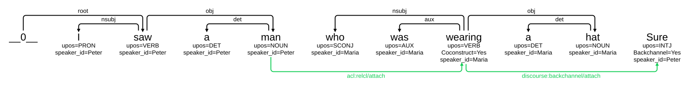

# How to encode co-construction is dependency treebanks?

## Publication

Ludovica Pannitto, Sylvain Kahane, Kaja Dobrovoljc, Elena Battaglia, Bruno Guillaume, Caterina Mauri, Eleonora Zucchini. [Coconstructions in Spoken Data: UD Annotation Guidelines and First Results](https://universaldependencies.org/udw26/papers/26_Paper.pdf), UDW 2026, Palma (Mallorca), Spain, May 2026.

See also the current draft for [Guidelines for Spoken Language UD Treebanks](https://grew.fr/spoken-language-guidelines/workgroups/spoken-data/).

## Encoding proposal

Two alternatives are:
 - **Speaker-based**: Each speaker utterance is a new tree, including back-channelling, other single-word utterances. Speaker ID attribute applies to the tree (implicitly all tokens within the tree).
 - **Dependency-based**: A tree may be the outcome of multiple speaker concatenations, each token has a Speaker ID attribute of its own, as there may be arbitrarily many speakers contributing.


## Example

### Speaker-based


### Dependency-based


---

## Example from SUD_French-Rhapsodie


More examples can be seen in Grew-match
 - [SUD_French-Rhapsodie@db](https://universal.grew.fr/?corpus=SUD_French-Rhapsodie@db):
   - request for cross-speaker dependencies (`/attach` relations): [Grew-match](https://universal.grew.fr/?corpus=SUD_French-Rhapsodie@db&request=pattern%20{%20e:%20X%20-[type=attach]->%20Y%20}&clust1_key=e.label)
   - `speaker_id` metadata is concatenated at the sentence level: [Grew-match](https://universal.grew.fr/?corpus=SUD_French-Rhapsodie@db&request=pattern%20{%20e:%20X%20-[type=attach]->%20Y%20}&clust1_key=meta.speaker)
 - [UniDive_kiparla_db](https://universal.grew.fr/?corpus=UniDive_kiparla_db)
 - [UD_Slovenian-SST_db@dev](https://universal.grew.fr/?corpus=UD_Slovenian-SST_db%40dev)

---

## Code
A script called [`sb_to_db.py`](sb_to_db.py) is available in this folder to convert the Speaker-based encoding to the Dependency-based encoding.
In the merged sentences, the new relations are marked with the suffix `/attach`.

The command below builds a dependency-based view of the sentences of the example give above:

```bash
python3 sb_to_db.py test/guidelines/speaker_based.conllu test/guidelines/dependency_based.conllu
```

**NOTE:** The `grewpy` library is required to run this code.
Installation instructions are available [here](https://grew.fr/usage/python/).
